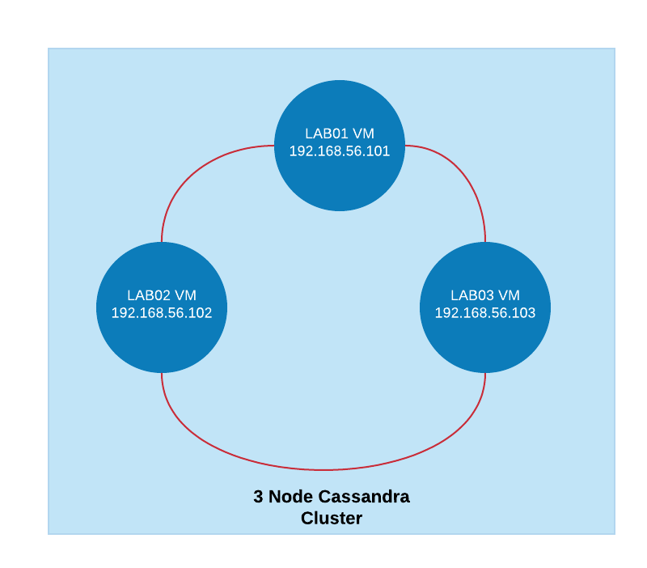

## Table of Contents
- [Getting Started](#getting-started)
  - [Development Environment Setup](#development-environment-setup)
  - [Unit Testing](#unit-testing)
  - [Installation](#installation)
- [Architecture](#architecture)
  - [File Structure](#file-structure)
  - [Environment Variables](#environment-variables)
- [Credits](#credits)

## Getting Started
### Development Environment Setup
### Unit Testing
TODO: unit test coverage

### Installation
#### Cassandra Setup
I have a 3 node cassandra cluster that makes use of [SimpeStrategy](https://docs.datastax.com/en/archived/cassandra/3.0/cassandra/architecture/archDataDistributeReplication.html) replication strategy as all the nodes are running on the same host guest OS (Similar to a single DC setup).

- Run this command on all three ubuntu VM's to install and run cassandra
  ```
  sudo apt update
  sudo apt-get install openjdk-8-jdk -y
  wget -q -O - https://www.apache.org/dist/cassandra/KEYS | sudo apt-key add -
  sudo sh -c 'echo "deb http://www.apache.org/dist/cassandra/debian 311x main" > /etc/apt/sources.list.d/cassandra.list'
  sudo apt-get update
  sudo apt install cassandra -y
  sudo systemctl enable cassandra
  sudo systemctl stop cassandra
  sudo systemctl start cassandra
  sudo systemctl restart cassandra
  ```
- Configure cassandra 3 node cluster
Edit /etc/cassandra/cassandra.yaml and update following entries
  ```
  cluster_name: 'Test Cluster'
  seed_provider:
    - seeds: "192.168.56.101"
  listen_address: 192.168.56.101
  rpc_address: 192.168.56.101
  endpoint_snitch: GossipingPropertyFileSnitch
  ```
  Repeat these steps in all 3 nodes and replace listen_address and the rpc_address with the vm's local ip address

- Restart the nodes
  ```
  sudo systemctl stop cassandra
  sudo systemctl restart cassandra
  ```
- Validate cluster status

  nodetool status
  
  ```
    
    --  Address         Load       Tokens       Owns (effective)  Host ID                               Rack
    UN  192.168.56.101  291.63 KiB  256          34.0%             93088d95-4e11-4f8c-9ca9-60e25ae57089  rack1
    UN  192.168.56.102  208.19 KiB  256          34.6%             d14ecef6-babd-481c-96bf-6930facbc460  rack1
    UN  192.168.56.103  246.92 KiB  256          31.3%             150187b2-eea9-4f33-bfa1-b039370f19fb  rack1
  ```

### Running
usage: pyton cassandra_loader.py -i <inputconfig file path>

## Python Dependencies
1. DataStax cassandra driver - https://docs.datastax.com/en/developer/python-driver/3.21/
```
pip install cassandra-driver
```

pip install tqdm
## Architecture
I have a 3 node cassandra ring setup.
The 3 nodes run on a oracle virtual box and the guest OS is a windows machine
- 198.168.56.101 node1
- 198.168.56.101 node2
- 198.168.56.101 node3




### File Structure

The default file structure looks like this:

```
thirdeye
├── src/                 # Python ETL source code
   ├── lib               # libraries
   ├── model             # Object mapper
   ├── config            # Configuration File
   ├── tests             # Unit test
├── input/airlines       # Data files
└── README.md            # This file
```
### Environment Variables

## Credits
- [Installing cassandra from debian package](https://cassandra.apache.org/doc/latest/getting_started/installing.html#installation-from-debian-packages)
- [Defining cassandra data schema](https://cassandra.apache.org/doc/latest/data_modeling/data_modeling_schema.html)
